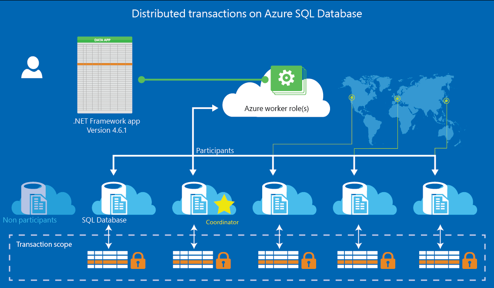

# 분산환경에서의 DB 일관성과 멱등성 유지

**작성자**: 김도엽 (도비)

**대상 독자**: 분산 DB 시스템 아키텍처를 도입한 서비스의 서버 개발자 및 관리자

**활용 계획**: 개발 블로그 포스팅

## 목차
1. 분산환경에서의 DB 일관성 개요
   • 분산환경이란?
   • DB 일관성이란?
   • 분산 환경에서의 DB 일관성 문제

2. 일관성을 보장하기 위한 전략과 도구
   • CAP 이론과 일관성
   • ACID vs BASE 모델
   • 분산 트랜잭션 관리
   • 이벤트 소싱과 CQRS
3. Kafka를 활용한 분산 환경에서의 일관성 관리
   • Kafka란?
   • Kafka를 통한 데이터 일관성 보장
   • Kafka Streams와 실시간 처리
4. 은행 시스템에서의 Kafka 사용 예시
5. 끝으로

## 1. 분산환경에서의 DB 일관성 개요

글에 들어가기에 앞서, `분산환경`과 `DB 일관성`에 대해 간단하게 짚고 넘어가보겠습니다.

### 1.1 분산환경이란?

>출처: Microsoft Learn

**분산환경**은 여러 노드(서버, 데이터베이스 등)가 네트워크로 연결되어 하나의 시스템처럼 상호작용하는 아키텍처를 말합니다. 이런 시스템은 노드 간의 상호작용을 통해 데이터 처리와 저장이 분산되어 이루어지는데, 이것을 통해 확장성과 가용성을 높일 수 있습니다. 하지만 물리적 네트워크 지연이나 노드 장애 등으로 인해 **데이터 일관성**을 보장하는 것이 어려운 단점이 존재합니다.

분산 시스템은 흔히 대규모 서비스에서 사용됩니다. Google, Amazon, Netflix와 같은 흔히 들어본 큰 규모의 웹 서비스들이 대표적인 예인데요.
예를 들어, Netflix가 제공하는 동영상 스트리밍 서비스는 전 세계에 분산된 서버를 통해 수백만 명의 사용자가 동시에 영상을 시청할 수 있도록 지원하죠. 이처럼 분산된 시스템에서는 수많은 서버가 동시에 작동하므로, 데이터 일관성 문제가 발생하기 쉽습니다.

### 1.2 DB 일관성이란?

**DB 일관성**이란 데이터베이스가 트랜잭션 수행 전후에 항상 유효한 상태를 유지하는 성질입니다. 데이터베이스 일관성이 보장되면, 사용자가 시스템에 접속하여 데이터를 조회하거나 수정할 때 오류가 없는 안정적인 데이터를 볼 수 있습니다.
한 가지 대표적인 예를 들어보자면, 은행에서 송금을 할 때 A 계좌에서 B 계좌로 금액이 정확하게 이체되어야하는 상황을 생각할 수 있습니다. 요청을 받은 DB에서 트랜잭션이 중간에 실패하더라도, 데이터베이스는 일관된 상태를 유지해야 합니다.

분산환경에서는 여러 노드가 동시에 데이터를 처리하므로, 단일 서버에서 일관성을 유지하는 것보다 더 많은 복잡성이 수반됩니다. 서로 다른 서버가 데이터를 동시에 처리할 때, 데이터가 불일치하는 상황을 어떻게 해결할지 고민해야 합니다.

이를 이해하기 위해 **CAP 이론**과 **ACID, BASE 모델**이 등장했습니다. 이 모델들에 대한 설명은 뒤에서 등장하는 개념들과 함께 설명하고자 합니다.

### 1.3 분산 환경에서의 DB 일관성 문제

그렇다면 분산 환경에서 어떤 경우에 앞서 설명한 DB 일관성에 대한 문제가 발생할 수 있을까요? 분산 시스템에서 일관성 문제가 발생하는 주요 원인은 다음과 같습니다:

1. **네트워크 지연**: 분산된 서버들이 서로 다른 지역에 위치하고 있을 때, 네트워크를 통해 데이터를 주고받는 시간이 발생합니다.
   예를 들어, 서울에 있는 서버와 미국에 있는 서버가 서로 데이터를 동기화할 때 약간의 지연이 발생할 수 있으며, 그 사이에 데이터 불일치가 생길 수 있습니다.

2. **노드 장애**: 분산 시스템에서는 노드가 고장날 수 있습니다.
   예를 들어, 여러 서버가 돌아가고 있는 하나의 시스템 내에서 어느 한 서버가 다운되었을 때, 그 서버에서 처리하던 데이터가 손실되거나 다른 서버와 동기화되지 않는 문제가 발생할 수 있겠죠.

3. **데이터 복제**: 분산 시스템에서는 데이터를 여러 서버에 복제하여 저장하는 경우가 많습니다.
   예를 들어, A 서버에서 데이터를 수정했는데, B 서버에 해당 수정 사항이 즉각 반영되지 않으면 데이터가 불일치하게 됩니다. 이를 방지하기 위해 데이터 복제본 간의 일관성을 유지하는 기술이 필요합니다.

이러한 문제를 해결하기 위해서는 분산 시스템의 특성에 맞는 데이터 일관성 보장 기법이 필요합니다.

그리고 이를 설명하기 위해 많은 방법론과 여러 개념들이 고안되었지만, 이 글에서는 **CAP 이론**과 **ACID, BASE 모델**에 대해 다뤄보고자 합니다.

## 2. 일관성을 보장하기 위한 전략과 도구: **CAP 이론**

### 2.1 CAP 이론과 일관성

**CAP 이론**은 분산 시스템에서 세 가지 속성: 일관성(Consistency), 가용성(Availability), 파티션 허용성(Partition Tolerance)을 설명하는 중요한 개념입니다. CAP 이론은 이 세 가지 속성을 모두 동시에 만족할 수 없다고 설명합니다. 즉, 일관성을 유지하려면 가용성이나 파티션 허용성을 어느 정도 포기해야 하고, 가용성을 우선할 경우 일관성을 약화시킬 수밖에 없습니다.

• **일관성(Consistency)**: 모든 노드에서 동일한 데이터를 확인할 수 있는 상태를 말합니다. 예를 들어, 사용자가 한 노드에서 데이터를 업데이트하면, 즉시 다른 노드에서도 같은 변경 사항을 볼 수 있어야 합니다.

• **가용성(Availability)**: 시스템의 일부가 장애를 겪더라도 계속해서 요청에 응답할 수 있는 성질입니다. 즉, 항상 시스템이 동작하고 있어야 합니다.

• **파티션 허용성(Partition Tolerance)**: 네트워크 상의 일부 노드 간 통신이 실패하더라도 시스템이 계속 작동하는 성질입니다. 이는 대규모 분산 시스템에서 흔히 발생하는 문제로, 일부 노드가 네트워크에서 분리되더라도 시스템이 전체적으로 작동해야 합니다.

이 이론에서 각 특성의 우선순위를 결정하는 것이 시스템 설계의 핵심입니다.

금융 시스템에서는 일관성을 우선시하는 것이 중요합니다. 사용자의 잔액이 항상 정확해야 하기 때문입니다. 반면, 소셜 미디어에서는 가용성이 더 중요한 요소일 수 있습니다. 사용자가 좋아요를 누른 게시물이 즉시 반영되지 않더라도, 전체 시스템은 계속 작동할 수 있어야 합니다.

이렇게 각 전략은 서비스의 성격을 고려하여 신중하게 선정되어야합니다.

### 2.2 ACID vs BASE 모델

**ACID**와 **BASE** 모델은 데이터베이스 트랜잭션 처리 방식의 두 가지 대표적인 모델입니다.

• **ACID 모델**은 전통적인 데이터베이스 트랜잭션에서 사용하는 원칙으로, **Atomicity(원자성)**, **Consistency(일관성)**, **Isolation(고립성)**, **Durability(지속성)** 을 보장합니다. 은행 거래와 같은 강력한 일관성이 필요한 환경에서 주로 사용됩니다. 예를 들어, 은행에서 계좌 간 이체를 할 때, 돈이 중간에 사라지지 않도록 모든 작업이 원자적으로 처리되어야 합니다.

• **BASE 모델**은 분산 시스템에서 자주 사용되는 방식으로, **Basically Available(기본적인 가용성)**, **Soft state(일시적인 비일관성 허용)**, **Eventual consistency(최종적 일관성)** 을 기반으로 합니다.
이는 일관성보다는 가용성을 우선시하며, 분산 시스템에서 데이터가 시간이 지나면 결국 일관성을 가지게 되는 것을 목표로 합니다. 예를 들어, 온라인 쇼핑몰에서 재고 정보가 즉시 반영되지 않더라도 최종적으로는 모든 서버에서 동일한 재고 정보를 가지게 되는 것이 BASE 모델의 예시입니다.

### 2.3 분산 트랜잭션 관리

**분산 트랜잭션 관리**는 여러 노드에서 발생하는 트랜잭션을 원자적으로 처리하기 위한 방법입니다. 이를 위해 **2PC(2-Phase Commit)** 와 **3PC(3-Phase Commit)** 같은 프로토콜이 사용됩니다.

• **2PC(2-Phase Commit)**: 트랜잭션을 두 단계로 나누어 처리하는 방법입니다. 먼저, 각 노드에 트랜잭션을 준비시키고(prepare), 모든 노드가 준비되면 트랜잭션을 커밋(commit)하여 완료합니다. 이는 모든 노드가 준비 완료 상태일 때만 트랜잭션이 성공적으로 완료되는 방식으로, 원자성을 보장합니다.

• **3PC(3-Phase Commit)**: 2PC의 단점을 보완하기 위해 중간에 타임아웃 메커니즘을 추가하여, 일부 노드가 응답하지 않을 때 시스템이 교착 상태에 빠지지 않도록 하는 방식입니다.

이와 같은 분산 트랜잭션 관리 방식은 여러 서버에서 트랜잭션을 안전하게 처리할 수 있도록 돕습니다.

### 2.4 (+ @) 이벤트 소싱과 CQRS

**이벤트 소싱(Event Sourcing)** 과 **CQRS(Command Query Responsibility Segregation)** 는 분산 시스템에서 데이터 일관성을 유지하는 또 다른 방법입니다.

• **이벤트 소싱**은 데이터의 변경 사항을 이벤트로 저장하는 방식입니다. 이 방식에서는 데이터의 최종 상태를 저장하는 대신, 데이터가 변경된 모든 이벤트를 기록하고, 필요한 경우 이벤트를 재생하여 최종 상태를 복원할 수 있습니다.
예를 들어, 은행 시스템에서는 모든 거래 내역을 이벤트로 기록하고, 이 이벤트를 기반으로 사용자의 최종 잔액을 계산할 수 있습니다.

• **CQRS**는 읽기 작업과 쓰기 작업을 분리하여 처리하는 아키텍처입니다. 쓰기 작업은 복잡한 트랜잭션을 처리하는 반면, 읽기 작업은 단순한 조회 작업만 수행하기 때문에 분리하여 효율적으로 처리할 수 있습니다. 이를 통해 성능을 높이고, 시스템의 복잡성을 줄일 수 있습니다.

## 3. Kafka를 활용한 분산 환경에서의 일관성 관리

### 3.1 Kafka란?

**Apache Kafka**는 고성능 분산 메시지 스트리밍 플랫폼입니다. Kafka는 데이터를 효율적으로 전송하고 처리하기 위한 **프로듀서(Producer)**, **컨슈머(Consumer)**, **토픽(Topic)** 등의 구성 요소로 이루어져 있습니다. Kafka는 특히 대량의 데이터를 빠르게 처리하고, 시스템 간 메시지를 안정적으로 전달하는 데 강점을 가지고 있습니다.

Kafka의 주요 특징 중 하나는 **파티션**을 통해 데이터를 분산시키고, **복제**를 통해 데이터 일관성을 유지하는 메커니즘입니다. 예를 들어, 한 서버에서 다른 서버로 데이터를 전송할 때 Kafka를 사용하면, 데이터를 안전하게 전송할 뿐만 아니라 여러 서버에 동시에 복제하여 데이터 일관성을 유지할 수 있습니다.

분산 환경에서 데이터 일관성과 가용성을 동시에 확보하는 것은 매우 어려운 과제입니다. 앞서 설명한 **CAP 이론**에 따르면, 분산 시스템에서 **일관성**과 **가용성**, **파티션 허용성** 중 세 가지를 동시에 만족시키는 것은 불가능합니다. 이러한 한계 속에서 **Kafka**는 분산 환경에서 데이터 일관성을 보장하는 데 매우 유용한 도구로 자리잡고 있습니다.

### 3.2 Kafka를 통한 데이터 일관성 보장

Kafka는 다양한 일관성 보장 모드를 제공합니다. 기본적으로 Kafka는 **최종 일관성**을 보장하는 방식으로 동작하지만, 설정에 따라 **최소 일관성**에서 **최대 일관성**까지 선택할 수 있습니다. Kafka는 메시지를 **복제**하여 데이터 손실 없이 일관성을 유지하는데, 각 파티션의 **리더**가 데이터를 관리하고, **팔로워**들이 이를 복제합니다. 이를 통해 데이터 일관성이 손상되지 않도록 보장할 수 있습니다.

예를 들어, 주문 처리 시스템에서 Kafka를 사용하면, 각 주문이 Kafka 토픽에 기록되고, 모든 서버에서 이를 실시간으로 처리하여 일관된 주문 상태를 유지할 수 있습니다.

### 3.3 Kafka Streams와 실시간 처리

**Kafka Streams**는 실시간 데이터 스트리밍을 처리하는 데 사용되는 도구로, 이를 통해 이벤트 기반 시스템에서도 데이터 일관성을 유지할 수 있습니다. 예를 들어, 주식 거래 시스템에서는 실시간으로 주식 가격이 변동되며, Kafka Streams를 통해 이러한 데이터를 처리하여 모든 사용자에게 일관된 데이터를 실시간으로 제공할 수 있습니다.

그리고 이런 한계를 생각했을 때, Kafka를 사용하는 이유는 다음과 같이 요약할 수 있습니다:

1. **일관성과 가용성의 균형 유지**: Kafka는 기본적으로 **최종 일관성(Eventual Consistency)** 을 제공하는 시스템으로 설계되었습니다. 즉, 분산된 여러 노드 간 데이터가 즉시 일치하지 않더라도, 시간이 지나면 결국 동일한 데이터를 확인할 수 있는 **BASE 모델**을 따릅니다. 이를 통해 가용성을 우선시하면서도, 일관성을 어느 정도 유지할 수 있는 분산 시스템을 구축할 수 있습니다. 예를 들어, 금융 거래나 주문 처리 시스템에서 일시적인 데이터 불일치를 허용하면서도, 최종적으로 데이터가 일관된 상태로 유지되는 것을 보장할 수 있습니다.

2. **데이터 복제와 내결함성**: Kafka는 **데이터 복제(replication)** 기능을 제공하여, 각 파티션의 데이터를 여러 노드에 복제하고, 리더-팔로워 구조를 통해 일관성을 유지합니다. 이는 데이터가 손실되거나 특정 노드에서 장애가 발생해도, 다른 복제본을 통해 데이터가 안전하게 유지될 수 있게 하는데요. 이를 통해 **파티션 허용성**을 유지하면서도 시스템이 복구 가능한 상태를 유지하도록 합니다.

3. **실시간 데이터 처리 및 스트리밍**: 앞서 설명하였듯이, Kafka는 **실시간 데이터 처리**에 적합한 도구라고 합니다. 대용량 데이터를 빠르고 안정적으로 전송할 수 있는 분산 메시징 시스템이며, 특히 **Kafka Streams**를 사용하면 실시간으로 데이터를 처리하면서도 시스템이 일관된 데이터를 제공하도록 할 수 있습니다. 이 점은 이벤트 기반 아키텍처나, 대규모 트래픽을 처리하는 분산 시스템에서 매우 유리합니다.

4. **확장성과 성능**: Kafka는 **확장성**이 뛰어나며, 수많은 노드에서 동시에 데이터를 읽고 쓸 수 있도록 설계되었다고 합니다. 이는 대규모 분산 시스템에서 중요한 요소로 노드가 추가되거나 트래픽이 급증해도 성능 저하 없이 시스템이 계속해서 운영될 수 있게 해주며, Kafka의 **파티션** 기능은 데이터를 여러 분할된 단위로 처리하여 성능을 최적화를 해준다고 합니다.

5. **유연한 일관성 모델**: Kafka는 다양한 일관성 모드를 지원합니다. 기본적으로는 최종 일관성을 제공하지만, 필요에 따라 **강한 일관성**(strong consistency)을 요구하는 트랜잭션 처리 방식을 제공하는데요, 시스템의 요구 사항에 따라 유연하게 일관성 수준을 선택할 수 있는 장점이 있겠습니다.

이러한 이유로 Kafka는 분산 환경에서 데이터 일관성을 유지하고, 시스템의 성능과 확장성을 극대화하기 위한 핵심 도구로 널리 사용됩니다. Kafka는 CAP 이론에서 완벽한 일관성과 가용성을 모두 제공할 수 없다는 한계를 인정하면서도, 시스템의 비즈니스 요구사항에 맞추어 일관성과 가용성 간의 균형을 유연하게 조정할 수 있게 해주는 유용한 도구입니다.

## 4 은행 시스템에서의 Kafka 사용 예시

Kafka가 은행 시스템에서 어떻게 유용하게 사용될 수 있는지, 실제 상황을 가정한 예시를 통해 살펴보려고 합니다.
고객 A가 고객 B에게 100만 원을 이체하는 상황을 예로 들겠습니다. Kafka가 있을 때와 없을 때, 어떻게 다르게 동작하는지 단계별로 비교해볼게요.

**Kafka 없이 진행되는 경우**

**상황**: 고객 A가 자신의 계좌에서 고객 B의 계좌로 100만 원을 이체.

이 트랜잭션은 다음과 같은 순서로 처리됩니다.

1. **이체 요청**: 고객 A가 온라인 뱅킹 앱에서 100만 원 이체를 요청합니다.

2. **트랜잭션 처리**: 은행 시스템이 고객 A의 계좌에서 100만 원을 출금하고, 고객 B의 계좌에 100만 원을 입금하는 작업을 처리합니다. 여기서 A 계좌와 B 계좌는 각각 다른 데이터베이스에 있을 수 있습니다.

3. **데이터베이스 반영**: 트랜잭션이 성공하면 A 계좌에서 돈이 빠지고, B 계좌에 돈이 입금됩니다.

**문제 발생 가능성**:

• **네트워크 장애**: 트랜잭션이 진행 중일 때 네트워크 문제로 B 계좌에 입금이 완료되지 않으면, A 계좌에서 이미 돈은 빠졌는데 B 계좌에서는 입금이 안 되는 문제가 발생할 수 있겠죠? 이를 복구하려면 복잡한 수동 처리가 필요합니다.

• **트랜잭션 중단**: 여러 데이터베이스에서 동시 처리해야 하는 분산 환경에서는 트랜잭션이 중간에 실패할 가능성이 있습니다. 예를 들어, A 계좌에서 돈은 빠졌지만, B 계좌에서는 입금이 실패하는 상황이 발생할 수 있죠. 이로 인해 시스템은 불일치한 상태에 놓이게 됩니다.

• **데이터 손실**: 장애나 시스템 오류가 발생하면 트랜잭션 기록이 손실될 수 있고, 이런 경우 데이터를 복구하기 어렵습니다.

**Kafka를 사용하는 경우**

**상황**: 똑같이 고객 A가 고객 B에게 100만 원을 이체하려고 합니다. 하지만 이번에는 Kafka를 사용하는 상황에서 어떻게 달라지는지 보여드리겠습니다.

1. **이체 요청**: 고객 A가 100만 원 이체 요청을 보냅니다.

2. **이벤트 생성**: Kafka의 **프로듀서(Producer)**가 이 이체 요청을 받아들여 **이벤트**로 만듭니다. 이 이벤트에는 A 계좌에서 B 계좌로 100만 원이 이동해야 한다는 정보가 담겨 있으며, 이 정보는 Kafka의 특정 **토픽(Topic)**에 기록됩니다.

3. **트랜잭션 처리 이벤트**: Kafka에 기록된 이벤트를 **컨슈머(Consumer)** 가 구독하고, A 계좌에서 돈을 출금하고 B 계좌에 입금하는 트랜잭션을 처리합니다. 이 과정은 **비동기적**으로 처리되므로, 실시간으로 여러 서버에서 병렬로 진행될 수 있습니다.

4. **데이터 복제 및 내결함성**: Kafka는 이 이벤트를 여러 **파티션**에 복제하여 저장합니다. 만약 트랜잭션 중 일부 시스템에 장애가 발생해도, Kafka에 기록된 이벤트를 통해 데이터를 안전하게 복구할 수 있겠죠? A 계좌에서 돈이 빠졌지만, B 계좌에 입금이 되지 않았다면, Kafka의 이벤트를 다시 재생해서 입금 과정을 복구할 수 있습니다.

5. **실시간 업데이트**: Kafka Streams를 사용하면 고객이 자신의 계좌 상태를 실시간으로 확인할 수 있습니다. 이체가 완료되자마자 고객 A와 B 모두 계좌 내역이 즉시 업데이트되는 것을 볼 수 있게 됩니다.

6. **장애 복구 및 일관성 유지**: 만약 네트워크 장애나 시스템 오류가 발생해도 Kafka에 기록된 이벤트는 안전하게 저장되어 있으며, 시스템이 복구되면 다시 재처리해서 데이터 일관성을 유지할 수 있습니다.

정리해보자면 다음과 같습니다.

#### **Kafka 사용 전후 비교**

| **Kafka를 사용하지 않은 경우**   | **Kafka를 사용한 경우**          |
| ----------------------- | -------------------------- |
| 트랜잭션 중단 시 데이터 불일치 발생 가능 | 이벤트 소싱으로 트랜잭션 재처리 가능       |
| 네트워크 장애 시 복구 어려움        | Kafka에 기록된 이벤트로 복구 용이      |
| 데이터베이스 간 동기화 문제 발생 가능   | 이벤트 기반으로 데이터 일관성 유지        |
| 트랜잭션 실패 시 수동 롤백 필요      | 장애 복구 후 이벤트 재처리로 자동 해결     |
| 실시간 데이터 업데이트 어려움        | Kafka Streams로 실시간 업데이트 가능 |
| 데이터 손실 가능성              | Kafka의 복제 기능으로 데이터 안전 보장   |

---

## 끝으로
분산 환경에서 데이터 일관성과 멱등성을 유지하기 위한 여러 가지 방법을 소개했습니다. Kafka는 그 중 하나의 도구로, 실시간 데이터 처리와 복제 기능을 통해 일관성을 유지하는 데 효과적일 수 있습니다. 하지만 모든 시스템이 Kafka에 적합한 것은 아닙니다. 시스템의 특성, 요구사항, 트래픽 패턴, 그리고 서비스의 우선순위에 따라 **CAP 이론**을 기반으로 적절한 전략을 선택해야 합니다. 때로는 **ACID** 트랜잭션이 필요한 강한 일관성이 요구되기도 하고, 반대로 **BASE** 모델처럼 유연성을 더 중시하는 접근이 필요할 수도 있습니다. 결국 중요한 것은 각각의 방법론과 도구들이 지닌 장단점을 이해하고, 상황에 맞는 적절한 해결책을 선택하는 것입니다.
이 글이 다양한 분산 시스템 전략을 선택하는 데 도움이 되기를 바랍니다.

**참고 자료**
1. [Apache Kafka 공식 문서](https://kafka.apache.org/documentation/)

2. [CAP Theorem 이해](https://en.wikipedia.org/wiki/CAP_theorem)

3. [Designing Data-Intensive Applications (Martin Kleppmann)](https://www.oreilly.com/library/view/designing-data-intensive-applications/9781491903063/)

4. [토스ㅣSLASH 22 - 왜 은행은 무한스크롤이 안되나요](https://youtu.be/v9rcKpUZw4o?si=gCIKSDciO_Clnnr9)
